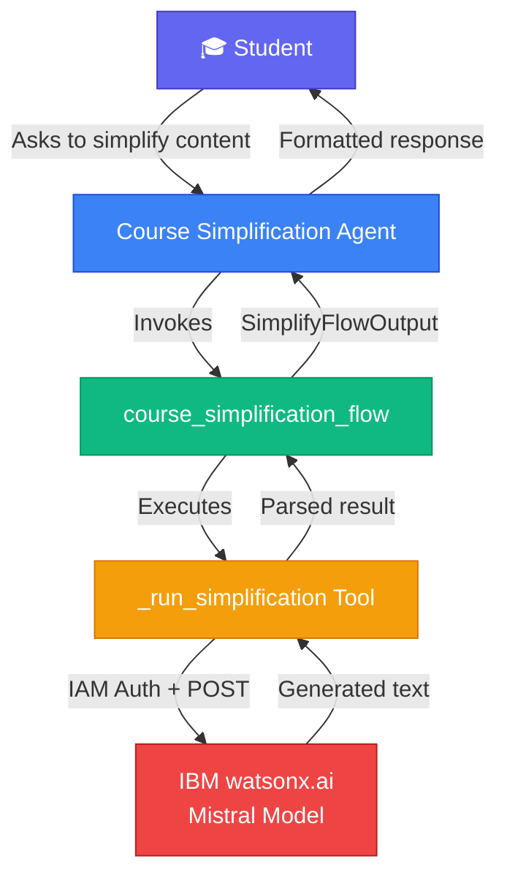
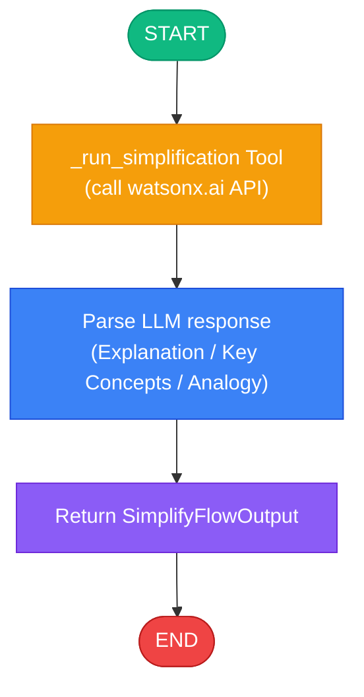

# Course Content Simplification Agent 🎓

## Overview

An AI-powered agent built on **IBM watsonx Orchestrate** that simplifies complex course content into clear, accessible explanations tailored to a student's learning level. It leverages the **IBM watsonx.ai** `mistralai/mistral-small-3-1-24b-instruct-2503` model via the EU-GB endpoint to generate:

- **Simplified explanations** appropriate to the learner's level
- **Key concept bullet points** for quick review
- **Real-world analogies** to make abstract ideas memorable

### Supported Learning Levels
| Level | Description |
|-------|-------------|
| `beginner` | No prior knowledge assumed. Simple words, everyday analogies, no jargon. |
| `intermediate` | Basic familiarity assumed. Some technical terms are briefly explained. |
| `advanced` | Strong domain knowledge assumed. Precise technical language and nuance. |

---

## Architecture Diagram



---

## Workflow Diagram



---

## Project Structure

```
course_simplification_agent/
├── __init__.py
├── main_flow.py               # Programmatic test script
├── import-all.sh              # CLI import script
├── README.md
├── tools/
│   ├── __init__.py
│   ├── simplify_content_tool.py   # Standalone @tool – direct watsonx.ai call
│   └── simplification_flow.py     # @flow wrapping the inline tool
├── agents/
│   └── course_simplification_agent.yaml
└── generated/
    └── course_simplification_flow.json  (auto-generated after main_flow.py)
```

---

## Prerequisites

- **Python** 3.10+
- **IBM watsonx Orchestrate ADK** installed (`pip install ibm-watsonx-orchestrate`)
- **`orchestrate` CLI** authenticated to your wxO environment
- IBM Cloud API Key with access to **watsonx.ai** in the `eu-gb` region

---

## Quick Start

### 1 — Import into watsonx Orchestrate

```bash
cd course_simplification_agent
chmod +x import-all.sh
./import-all.sh
```

### 2 — Chat with the Agent

```bash
orchestrate chat start
# Select: course_simplification_agent
```

### 3 — Test Programmatically

```bash
export PYTHONPATH=/path/to/adk/src:/path/to/adk
python3 main_flow.py
```

---

## Sample Interactions

**User**: *"Can you simplify the concept of recursion for a beginner in Python programming?"*

**Agent**:
> **Simplified Explanation**
> Recursion is when a function calls itself to solve a smaller version of the same problem…
>
> 📌 **Key Concepts**
> • A function that calls itself
> • Must have a base case to stop
> • Each call works on a smaller sub-problem
>
> 💡 **Real-World Analogy**
> Think of Russian nesting dolls (Matryoshka). Each doll contains a smaller doll until you reach the smallest one — that's your base case!

---

## Configuration

| Parameter | Value |
|-----------|-------|
| watsonx.ai URL | `https://eu-gb.ml.cloud.ibm.com/ml/v1/text/generation?version=2023-05-29` |
| Model ID | `mistralai/mistral-small-3-1-24b-instruct-2503` |
| Project ID | `c939efef-896c-492f-b8b0-d9acb0ede092` |
| Max New Tokens | `800` |
| Decoding Method | `greedy` |

---

## Features

- 🤖 Powered by **IBM watsonx.ai Mistral** model
- 🎯 Three adaptive learning levels (beginner / intermediate / advanced)
- 📌 Structured output: explanation + key concepts + analogy
- 🔐 Automatic IAM token exchange from API key
- 💬 Friendly starter prompts and welcome message in the chat UI
- 🔄 Re-runnable at different learning levels on request
